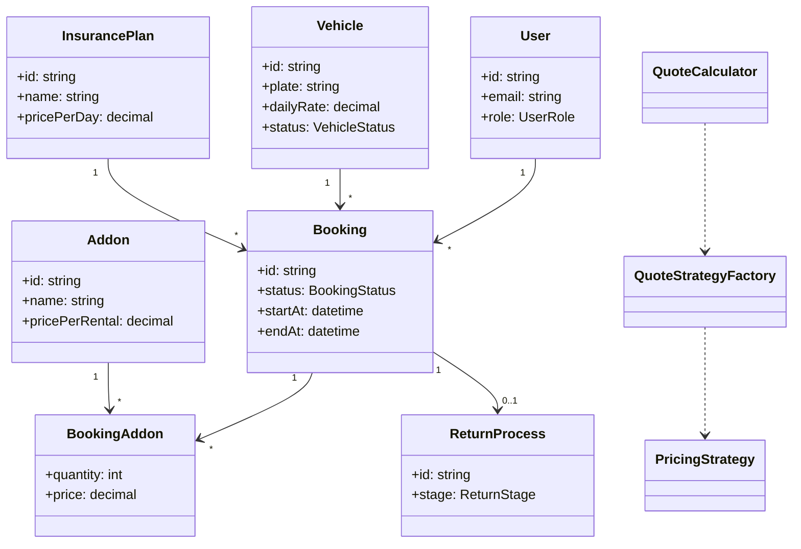

# Rent Car Processing System (RCPS)

Full-stack MVP for the ICT2112 RCPS specification. This repo includes a NestJS API, a React UI, and a Postgres database using Prisma.

## Class Diagram



## SOLID Principles (How the code aligns)
- **Single Responsibility**: Each pricing rule is isolated in its own strategy class (e.g., base rate vs deposit logic).
- **Open/Closed**: New pricing rules can be added by creating a new `PricingStrategy` without modifying existing ones.
- **Liskov Substitution**: All strategies adhere to the same `PricingStrategy` interface and can be swapped safely.
- **Interface Segregation**: Pricing logic depends only on the small `PricingStrategy` interface, not larger service contracts.
- **Dependency Inversion**: `RentalService` depends on abstractions (`QuoteCalculator` + `PricingStrategy`), not concrete pricing rules.

## Design Patterns (Why they are used)
- **Strategy**: Pricing rules are modular and interchangeable to match evolving business rules (insurance tiers, deposits, discounts).
- **Factory**: `QuoteStrategyFactory` centralizes the creation and ordering of pricing strategies to keep wiring consistent.

## Quick Start

1) Copy env files and adjust values.

```
cp .env.example .env
cp apps/backend/.env.example apps/backend/.env
cp apps/frontend/.env.example apps/frontend/.env
```

2) Start services.

```
docker-compose up --build
```

3) Initialize the database (first run only).

```
cd apps/backend
npm install
npx prisma migrate dev --name init
npx prisma db seed
```

4) Run apps locally without Docker (optional).

```
# backend
cd apps/backend
npm install
npm run dev

# frontend
cd ../../apps/frontend
npm install
npm run dev
```

## Repo Layout

- `apps/backend` NestJS API, Prisma schema, seed data.
- `apps/frontend` React UI (Vite).
- `docker-compose.yml` local Postgres + services.
## Demo Login

- Email: `staff@rcps.dev`
- Password: `password123`
